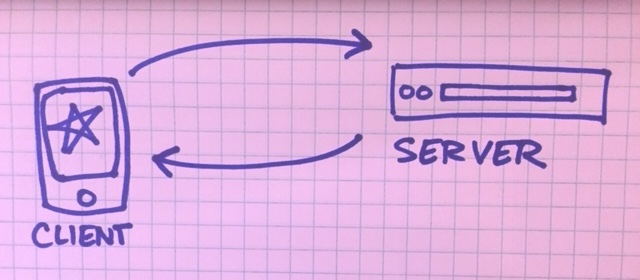

# Act II: Web Applications with Django

In this final unit of CS10, you are going to take on a new scale of challenge:
you're going to learn a professional web application framework called
[Django](https://www.djangoproject.com/).

You have already learned about [web applications]() (servers), programs which receive requests and send responses. Every time you use the internet, you're communicating with servers. Every time you use an app, the app is communicating with servers for you. 

Professional computer scientists generally don't write web applications from
scratch. The reality is that many web apps use a lot of similar pieces. A
framework is a collection of ready-made pieces which already fit well together
and take care of a lot of low-level stuff that works the same in pretty much web
app. Why bother rewriting it? 

Most of the code you have been given so far in CS9 and CS10 has been written for
you by your teachers. Django is different: it's the most-used Python web app framework. It contains a huge amount of code, including lots that you won't be able to understand yet. (Though you'll never see most of it.) On the other hand, [Django's documentation](https://docs.djangoproject.com/en/3.1/) is excellent, there are hundreds of thousands of Django questions on [Stack Overflow](https://stackoverflow.com/questions/tagged/django), and once you know Django you could seriously get a well-paying job. Instagram is written in Django. 

## The plan

The next three lessons will introduce you to what Django actually does. You'll
set up a basic app and follow along as we go through three different
*lifecycles*: 

0. The **request/response** lifecycle happens when Django receives a request from a client
  computer. Django looks at the request, decides what to do (this is where your
  code comes in!), and puts together a response. A request/response lifecycle
  takes a fraction of a second. 
1. The **runtime** lifecycle lasts from the moment you start up your Django app
   to the moment you kill the program (or it crashes). A Django app is just a regular Python program, 
   which starts and stops like normal. When you start Django, it will
   stay alive forever waiting for requests, until you kill it or trip over the
   power cord...
2. The **project lifecycle** is the ongoing process of developing your Django
   app. Just like all your other projects, you'll keep the source code for your
   app in a GitHub repo, and you'll update your app from time to time with shiny
   new features. However, when you have *production data*, things get a little
   more complicated. You wouldn't want all your users to get their passwords and
   cat videos deleted every time you update your app!

OK, fun! Ready? [Let's get started >>>>]()
